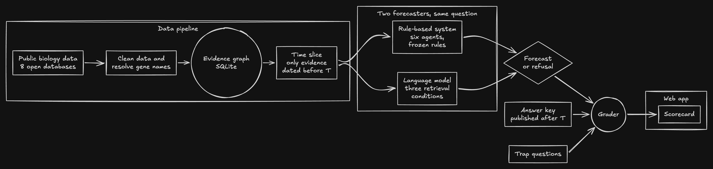
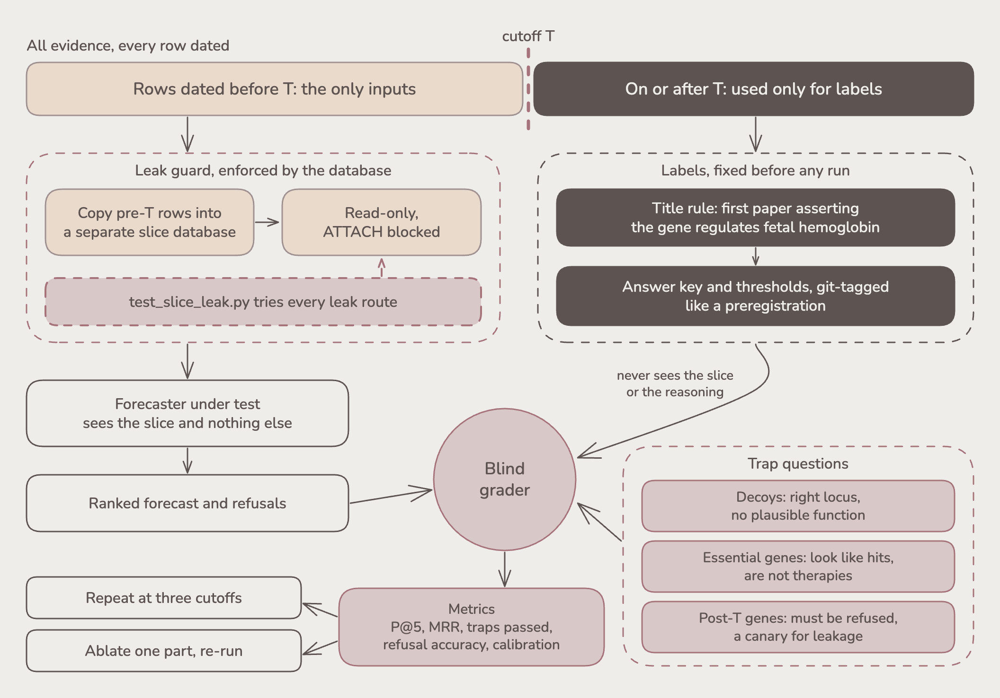
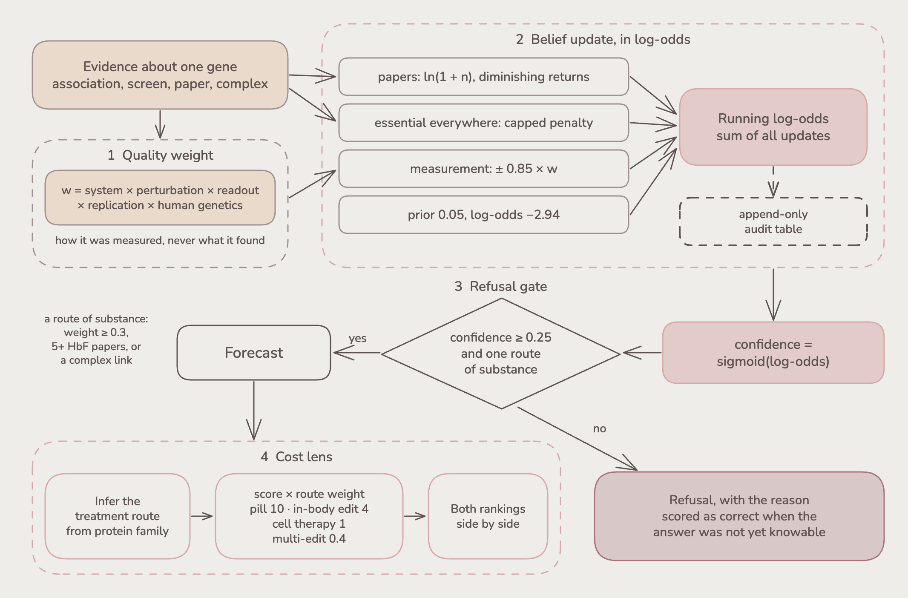

# Architecture

Three diagrams, from the whole pipeline down to one score. Each section
explains the idea in ML terms, because the biology is the domain and not the
method.

The diagrams share one colour code: blue is evidence, violet is the rule-based
system, orange is the language model, green is grading, red is a guard or a
refusal, and yellow is the cost lens. Each source is the `.excalidraw` scene of
the same name in `diagrams/`, which opens in
[Excalidraw](https://excalidraw.com) and is rendered with:

```bash
npx -y @excalidraw/cli@0.3.0 render diagrams/<name>.excalidraw \
  --out diagrams/<name>.png --scale 2 --padding 28
```

The results chart in the README is the one scene that is generated:
`scripts/render_results_chart.py` writes `diagrams/results.excalidraw` from
`eval/results/`.

## The biology in five lines

You need very little of it to follow the system.

| Term | What it means here | ML analogy |
| --- | --- | --- |
| Fetal hemoglobin (HbF) | A form of the oxygen-carrying protein that treats sickle cell disease if switched back on | The target variable |
| Gene | A unit of DNA; the thing being ranked | One candidate in a ranking task |
| CRISPR screen | Knock out thousands of genes one at a time and measure the effect | Feature ablation at genome scale |
| Genetic association (GWAS) | A DNA variant that correlates with a trait across many people | Correlation, not causation; can be a nearby bystander |
| Essential gene | A gene every cell needs to survive | A feature whose removal breaks everything, so it looks important in every screen |

## 1. System architecture

The whole pipeline in one line: public data is cleaned into a graph, cut at a
date, reasoned over, and graded against what was published afterwards. Two
forecasters read the same slice, the rule-based system and a language model,
and one grader scores both.



## 2. Evaluation design: a leak-proof time split

A time-based train/test split, enforced by infrastructure rather than by
convention.



- **The split is physical, not logical.** A `WHERE date < T` filter can be
  forgotten in one query. Here the pre-T rows are copied into their own
  database, opened read-only, with `ATTACH` denied, so the reasoning code cannot
  reach post-T data even by mistake. A test tries each leak route and asserts it
  fails.
- **Labels and thresholds are preregistered.** The answer key comes from a
  stated rule over real publications, and every threshold was committed and
  git-tagged before the first run. The tag's timestamp is the proof that nothing
  was tuned on the test set. The cost of that is visible in the results: two
  correct genes sit at 0.240 against a 0.25 threshold, and the threshold was not
  moved.
- **The test set includes adversarial cases.** Decoys check that the system does
  not confuse correlation with cause. Post-T genes work as leakage canaries: a
  system that claims one has seen the future.
- **The grader is blind.** It receives only the forecast and the answer key, so
  it cannot be influenced by the reasoning it is scoring.
- **Ablations and multiple cutoffs** show which component earns its keep, and
  whether a result holds across time rather than on one lucky split.

## 3. Scoring: from evidence to a forecast or a refusal

The forecaster is a hand-specified log-odds model, close in spirit to naive
Bayes with fixed, documented weights instead of fitted ones. There is no
training step, because the only labels that could be trained on are the answer
key.



- **Weights judge the measurement process, not the outcome.** The quality weight
  reads how an experiment was run (which cell type, which perturbation, how
  direct the readout) and never its result. Two identical screens get the same
  weight whether they found an effect or not, which prevents the model from
  rewarding the results it already expects. The terms multiply, so a poor
  experimental system discounts everything measured in it.
- **Correlated evidence is dampened.** A hundred papers about one gene are not a
  hundred independent observations, so literature adds `ln(1 + n)` rather than
  `n`. Five HbF papers alone reach exactly 0.240.
- **Refusal is a first-class output.** Below the gate the system returns a
  refusal naming what is missing. This is selective prediction: a refusal on a
  question whose answer did not yet exist counts as correct. The second
  condition stops a pile of weak co-mentions from carrying a claim over the
  confidence line.
- **Every number is auditable.** Each update is a row in an append-only table,
  enforced by SQLite triggers. A provenance check traces every number in the
  output back to a source record and the scorecard reports any it cannot; the
  count is zero in every run.
- **The ranking objective is explicit.** Confidence alone would favour
  expensive cell therapies. Multiplying by a stated cost weight per treatment
  route produces a second ranking, shown next to the first so the effect of the
  objective is visible.

Every coefficient and its justification is in [METHODOLOGY.md](METHODOLOGY.md).

## 4. The six agents

The rule-based system is six agents with narrow contracts. None uses a language
model; every judgement is a stated rule in a documented module.

| Agent | What it does | What it must never do |
| --- | --- | --- |
| Curator | Normalizes raw records to the schema, resolving symbols through HGNC and cell lines through Cellosaurus | Guess: a record it cannot resolve is excluded with a reason |
| Method signature | Gives each measurement the quality weight of section 3 | Read what the measurement concluded |
| Axiom extractor | Turns pre-T evidence into executable rules | Emit a rule that cannot name the records it came from |
| Belief reviser | Accumulates log-odds in publication-date order, one audit row per update | Rewrite an audit row; SQLite triggers make the table append-only |
| Adversary | Plants traps before grading, drawn from the data itself | Invent a trap: the decoys OR51B5 and OR51B6 are author-reported genes at an HbF-associated locus (p = 3e-08) with no plausible role in globin regulation |
| Grader | Scores the forecast against the answer key | See the slice or the beliefs it is grading |

## 5. Why the system is not a learned model

I explored convolutional Kolmogorov-Arnold networks as a way to get more out of
scarce data, since they are parameter-efficient on small datasets. I dropped
the idea for three reasons.

1. **Capacity is not the bottleneck.** The missed genes have no pre-cutoff
   features at all.
2. **No structure to exploit.** The evidence for each gene is a row of tabular
   features with no spatial or sequence structure for a convolution.
3. **No labels that respect the time split.** The only ones are the 25 genes
   already established before the 2017 cutoff, and fitting weights at all would
   break the rule that every coefficient is stated and frozen before the answer
   key is seen.
