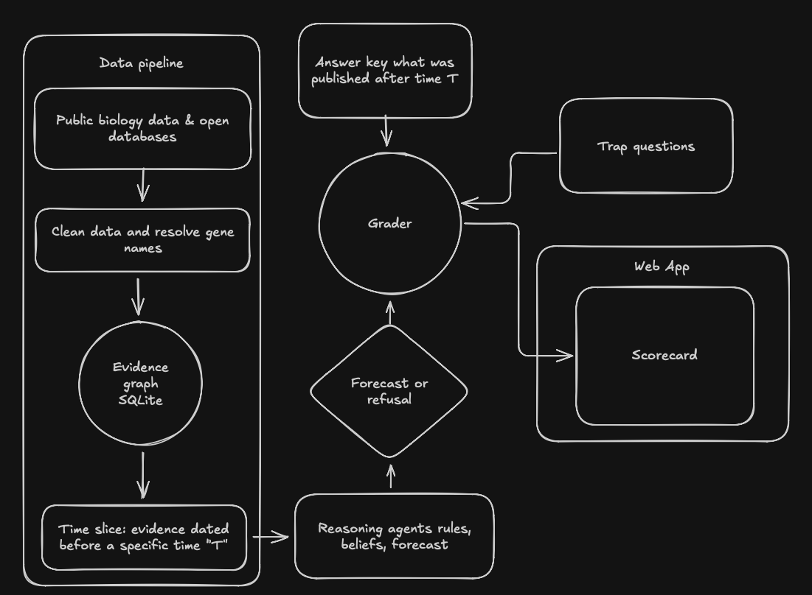

# CRISPR HINDCAST


Given only the evidence available on date T,
can a system recover the governing rules of a field and correctly forecast what
would be discovered after T?

The domain is fetal hemoglobin induction as a therapeutic route for sickle cell
disease. The method is a temporal holdout enforced at the data layer, with the
subsequent literature as the answer key.



Public data is cleaned into an evidence graph, cut at a date T, and reasoned
over. The forecast is graded against what was actually published after T, with
trap questions mixed in. [ARCHITECTURE.md](ARCHITECTURE.md) has two more
diagrams in moderate detail: how the evaluation is kept free of leakage, and how
a gene's evidence becomes a prediction or a refusal.

## Table of Contents

* [What this is, in plain words](#what-this-is-in-plain-words)
* [Launch the app](#launch-the-app)
* [Scorecard](#scorecard)
  * [Ingestion](#ingestion)
  * [Scorecard, full system](#scorecard-full-system)
  * [Ablations, primary slice](#ablations-primary-slice)
  * [Traps, primary slice, named individually](#traps-primary-slice-named-individually)
  * [Reliability, primary slice, full system](#reliability-primary-slice-full-system)
  * [Cost lens, full system](#cost-lens-full-system)
  * [Held-out recovery](#held-out-recovery)
* [Using temporal holdout as an alternative for contamination control](#using-temporal-holdout-as-an-alternative-for-contamination-control)
* [What the system does](#what-the-system-does)
* [The cost lens](#the-cost-lens)
* [Results](#results)
* [Licensing](#licensing)
* [Repository](#repository)

## What this is, in plain words

Sickle cell disease is caused by faulty adult hemoglobin, the protein that
carries oxygen in blood. Before birth we all make a different version, fetal
hemoglobin, which does not sickle. It switches off after birth, and turning it
back on eases the disease. For decades researchers have been working out which
genes control that switch.

This project asks a simple question: **could a reasoning system have seen those
discoveries coming?** It picks a cutoff date, say the end of 2017, and hides
everything published after it. Using only the older evidence (genetic studies,
lab screens and publication records), the system names the genes it expects the
field to discover next, or says honestly that the evidence is not there yet.
Then the sealed envelope is opened: the prediction is graded against what
researchers actually published after the cutoff.

It is a fair test because the hiding is enforced by the database and checked by
tests, the answer key is the real published record rather than something the
author wrote, and every rule and threshold was frozen in git before the first
run. There is no AI language model inside. Every decision is a written rule you
can read.

The short version of the results: the system is cautious. It predicts two to six
genes per cutoff, gets one right each time, avoids every trick question planted
for it, and misses the two biggest discoveries after 2017 because the open data
before 2018 held almost no trace of them. The app and the sections below explain
why, without hiding the weak numbers.

## Launch the app

The app is a local website that explains the project, shows every result, and
lets you re-run the whole pipeline from your browser. It works offline, with no
API keys.

**You need:** [Python 3.12+](https://www.python.org/downloads/),
[uv](https://docs.astral.sh/uv/getting-started/installation/) (the Python
package manager) and [Node.js 20.9+](https://nodejs.org/). Run everything from
the repository root.

```bash
# 1. Install the Python pipeline (once)
uv venv --python 3.12 .venv
uv pip install -e ".[dev]"

# 2. Build the evidence graph from the committed data snapshot (under a minute)
.venv/bin/hindcast build

# 3. Install and start the web app (the npm install is only needed once)
cd web
npm install
npm run dev
```

Open **http://127.0.0.1:4100**. What you can do there:

- **Overview**: the idea in plain language, with a timeline you can drag to see
  which discoveries each cutoff hides.
- **Results**: each cutoff's forecast, ranked by confidence or by how affordable
  the resulting treatment would be, plus every refusal with its reason, the
  trick questions, and a calibration chart.
- **Ablations**: switch parts of the system off and see what each one is worth.
- **Genes**: look up any gene to see what the system said about it at each
  cutoff, and when the field actually found it.
- **Run the pipeline**: rebuild the graph, re-run any cutoff or all of them, run
  the held-out test, and run the test suite, with live output. Results appear in
  the other pages as soon as a run finishes.
- **Docs**: the methodology, data sources, schema and limitations.

Steps 1 and 2 can also be done from the Run page once the app is up. For a
faster, production build of the app, use `npm run build && npm run start`
instead of `npm run dev`. The app serves on port 4100 by default; to use another
port, run `npx next dev --port <port>`.

### Command line only

Everything the app does is also available from the terminal:

```bash
.venv/bin/hindcast slice --cutoff 2017-12-31   # run one cutoff (about 20 seconds)
.venv/bin/hindcast heldout --cutoff 2017-12-31 # held-out recovery test
.venv/bin/hindcast run-all                     # every cutoff and every ablation
.venv/bin/hindcast scorecard                   # print the results table
.venv/bin/python -m pytest -q                  # the checks that must pass to ship
```

Runs rewrite `eval/results/` and `trajectories/`. The results are deterministic,
so in practice only the trajectory timestamps change, and
`git checkout -- eval trajectories` restores them.

To re-fetch from the sources instead of using the snapshot, the scripts in
`scripts/` do it one source at a time, and `hindcast build-snapshot`
re-normalizes the result. That path needs a network and takes about an hour,
most of it Europe PMC pagination.

## Scorecard

<!-- SCORECARD:START -->

### Ingestion

| Measure | Value |
| --- | --- |
| Source records considered | 295,986 |
| Nodes loaded | 287,026 |
| Edges loaded | 231,751 |
| Excluded, with a recorded reason | 10,269 |
| Spurious records created | 0 |

Exclusions by reason:

| Reason | Records |
| --- | --- |
| out_of_scope | 6,341 |
| malformed_record | 3,345 |
| unresolved_symbol | 371 |
| unresolvable_date | 117 |
| unresolved_cell_line | 95 |

### Scorecard, full system

| Slice | Ground truth | Forecast | Refusals | P@5 conf | P@5 cost | P@10 conf | MRR | Judgement traps | Contamination traps | Refusal acc | ECE | Fabricated |
| --- | --- | --- | --- | --- | --- | --- | --- | --- | --- | --- | --- | --- |
| 2014-12-31 | 19 | 2 | 47 | 0.20 | 0.20 | 0.10 | 0.500 | 6/6 | 16/16 | 16/16 (1.00) | 0.302 | 0 |
| 2017-12-31 | 13 | 2 | 42 | 0.20 | 0.20 | 0.10 | 0.500 | 7/7 | 8/8 | 8/8 (1.00) | 0.199 | 0 |
| 2020-12-31 | 3 | 6 | 28 | 0.20 | 0.20 | 0.10 | 0.333 | 7/7 | 2/2 | 2/2 (1.00) | 0.066 | 0 |

### Ablations, primary slice

| Ablation | Forecast | Refusals | P@5 conf | P@10 conf | MRR | Judgement traps | ECE |
| --- | --- | --- | --- | --- | --- | --- | --- |
| full system | 2 | 42 | 0.20 | 0.10 | 0.500 | 7/7 | 0.199 |
| no belief revision | 0 | 44 | 0.00 | 0.00 | 0.000 | 0/7 | 0.245 |
| no graph | 60 | 0 | 0.00 | 0.00 | 0.062 | 7/7 | 0.225 |
| no method signature | 2 | 42 | 0.20 | 0.10 | 0.500 | 7/7 | 0.198 |
| no ontology normalization | 2 | 42 | 0.20 | 0.10 | 0.500 | 7/7 | 0.199 |

### Traps, primary slice, named individually

| Trap | Kind | Correct answer | System answer | Result |
| --- | --- | --- | --- | --- |
| HBBP1 | association_without_function | reject | refused | pass |
| OR51B5 | association_without_function | reject | refused | pass |
| OR51B6 | association_without_function | reject | refused | pass |
| EIF2S1 | pan_essential | reject | refused | pass |
| CTCF | pan_essential | reject | not forecast | pass |
| RBBP4 | pan_essential | reject | refused | pass |
| PRMT5 | pan_essential | reject | not forecast | pass |
| ATF4 | postdates_cutoff | refuse | refused | pass (contamination check) |
| EIF2AK1 | postdates_cutoff | refuse | refused | pass (contamination check) |
| GATAD2A | postdates_cutoff | refuse | refused | pass (contamination check) |
| HIC2 | postdates_cutoff | refuse | refused | pass (contamination check) |
| MTA2 | postdates_cutoff | refuse | refused | pass (contamination check) |
| NFIX | postdates_cutoff | refuse | refused | pass (contamination check) |
| RBBP4 | postdates_cutoff | refuse | refused | pass (contamination check) |
| ZNF410 | postdates_cutoff | refuse | refused | pass (contamination check) |

### Reliability, primary slice, full system

| Confidence bin | Claims | Mean confidence | Observed frequency |
| --- | --- | --- | --- |
| 0.0 to 0.2 | 38 | 0.091 | 0.237 |
| 0.2 to 0.4 | 5 | 0.253 | 0.800 |
| 0.4 to 0.6 | 1 | 0.486 | 0.000 |
| 0.6 to 0.8 | 0 | 0.000 | 0.000 |
| 0.8 to 1.0 | 0 | 0.000 | 0.000 |

### Cost lens, full system

| Slice | Forecast | Items reordered by cost weighting | Top by confidence | Top by cost impact | Surfaces a small molecule |
| --- | --- | --- | --- | --- | --- |
| 2014-12-31 | 2 | 2 | EX_VIVO_SINGLE_EDIT | SMALL_MOLECULE | yes |
| 2017-12-31 | 2 | 0 | EX_VIVO_SINGLE_EDIT | EX_VIVO_SINGLE_EDIT | no |
| 2020-12-31 | 6 | 5 | EX_VIVO_SINGLE_EDIT | SMALL_MOLECULE | yes |

### Held-out recovery

| Slice | Genes tested | Recovered | Rate | Mean confidence drop |
| --- | --- | --- | --- | --- |
| 2014-12-31 | 1 | 1 | 1.00 | 0.309 |
| 2017-12-31 | 1 | 1 | 1.00 | 0.192 |
| 2020-12-31 | 5 | 5 | 1.00 | 0.029 |

<!-- SCORECARD:END -->

## Using temporal holdout as an alternative for contamination control

This project exists because of a problem stated publicly by
[Cortex Bio](https://cortexbiolabs.com) in their July 2026 case study
"Designing molecules that have never been made". Their evaluation used name
anonymization as the contamination control and an answer key they wrote
themselves. Both choices are reasonable and both have a hole in them.

Name anonymization hides the label and leaves the fingerprint. A model that has
read the literature does not need to be told a gene is called BCL11A: the
combination of a zinc finger, an erythroid enhancer at +58 kilobases, and an
association with fetal hemoglobin identifies it uniquely, and every one of those
facts has to stay in the problem for the problem to be answerable. Anonymization
also cannot be verified. There is no test you can write that proves a
description no longer identifies its subject.

A temporal holdout is a different kind of control, and its two advantages are
worth stating separately. It is verifiable: the claim "no evidence dated on or
after T reached the reasoning" is a property of a data layer, and this
repository enforces it by materializing a separate database holding only pre-T
rows and serving it over a connection that cannot attach anything else.
`tests/test_slice_leak.py` attempts the leak by every route and asserts each one
fails. And the answer key is not self-authored: what the field published after T
is a fact about the world, recorded in `eval/rulebook/` by a stated rule, frozen
and git-tagged before the first evaluation run.

A temporal holdout does not solve contamination, and LIMITATIONS.md says so
plainly. It controls the evidence, not the reader. A language model placed in
this pipeline would already have read the 2018 result, and no data-layer
enforcement can remove that. What the holdout buys is that the control is
checkable and the key is independent, which is more than anonymization can
offer.

This is an independent benchmark for a problem Cortex Bio named. It is not a
reimplementation of their product and makes no claim about it.

## What the system does

Six agents with narrow contracts, no language model anywhere, every judgement a
stated rule in a documented module.

1. **Curator** normalizes raw records to the schema, resolving symbols through
   HGNC and cell lines through Cellosaurus, and excluding anything it cannot
   resolve rather than guessing.
2. **Method signature** assigns each measurement a weight from how it was
   produced and never from what it concluded. Five terms: the system, the
   perturbation, the readout's directness, independent replication, and human
   genetic support. Multiplicative, so a weak system discounts everything
   measured in it. See METHODOLOGY.md for every coefficient and its reason.
3. **Axiom extractor** turns pre-T evidence into executable rules. A validator
   rejects any axiom that cannot name the records it came from, which is how
   "no number without a source row" becomes structural rather than aspirational.
4. **Belief reviser** accumulates log-odds in publication-date order, writing an
   append-only audit row for every update. SQLite triggers enforce the
   append-only property, so it is a property of the database rather than a habit
   of the code.
5. **Adversary** plants traps before grading, drawn from the data itself. The
   geometry-failure trap is not invented: the olfactory receptor genes OR51B5
   and OR51B6 are author-reported genes at an HbF-associated locus with a
   p-value of 3e-08 and no plausible role in globin regulation. 
6. **Grader** scores the forecast. It takes no slice and no belief map, so it
   cannot see the reasoning it is grading.

Refusal is built before the answer path and is a scored outcome. "The evidence
before T does not support a claim here" is a correct answer on questions whose
answer postdates T, and it earns points.

## The cost lens

Casgevy lists at about $2.2M and Lyfgenia at about $3.1M, neither figure
including the required inpatient stay. Both need apheresis, GMP manufacturing of
an autologous product, and busulfan myeloablative conditioning. That pathway is
unavailable in most of the regions carrying the disease burden.

So the final ranking is not by confidence. Every claim carries an implied
therapeutic route with a cost class, inferred from pre-T facts only, meaning the
HGNC protein family and whether the effect runs through a cis-regulatory
element. The forecast is reported twice, ranked by confidence and ranked by
confidence times the route's cost weight, side by side, so the reordering is
visible rather than asserted.

## Results

Numbers that look bad are left in. 

**The forecast is small and its precision is low.** Two genes at the 2017 slice,
six at 2020. P@5 is 0.20 everywhere, which here means one correct gene in a
five-slot window. The system refuses far more often than it forecasts, and that
is the refusal rule working as specified rather than a result to be proud of: on
this evidence base most genes genuinely cannot be called.

**The two headline post-2017 findings were not recovered.** EIF2AK1 and ZNF410
are both refused. Their pre-2018 record, after the title rule is applied, is two
HbF publications and zero. Neither has a measurement in any ingested source.
The refusal is correct given what the system can see, and it is simultaneously a
missed forecast, so both appear as a passed contamination check and as an absent
answer. The scorecard reports both rather than choosing the flattering one.

**Two correct answers sit just under the refusal threshold.** LIN28B and HDAC2
both reach confidence 0.240 against a frozen threshold of 0.25, on exactly five
HbF publications each. A threshold of 0.24 would have forecast both and roughly
tripled P@5. The threshold was committed and tagged before this run and has not
been moved. That is the whole point of the tag, and it is the clearest example
in the repository of what freezing a policy costs.

**Two of the five ablations change nothing.** Removing the method signature and
removing ontology normalization leave the forecast, the ranking and the traps
identical, to three decimal places on ECE. They earn nothing measurable here,
because the pre-2018 slice contains no functional HbF measurement for them to
weight: all thirty HbF-family measurements are genetic associations. Belief
revision does carry the result, and the no-graph row is the one that separates
the system from a literature count.

**The composition route never fires at the primary slice.** ACTS_THROUGH is
derived and present, 180 edges over 90 shared-complex gene pairs, but it
produces zero axioms at 2017 because no measurement-backed partner sits in any
curated complex. Five of the thirteen ground-truth genes at that slice are NuRD
subunits that a looser partner rule would have reached. The rule was not
loosened, because it would have been loosened after seeing the answer key.

**Held-out recovery is close to vacuous.** It reports 1 of 1 at two slices,
because only BCL11A clears reportability on measurement evidence alone in the
early windows. A rate of 1.00 over one gene is not evidence of anything.

**Data Limitation.** BioGRID ORCS curates no
fetal hemoglobin screen. The screens behind the field's key HbF results are not
in any open, dated, redistributable form, so the pre-T evidence base here is
human genetic association data, essentiality data, and dated bibliographic
metadata, not the screen record. Nearly every weakness above follows from that.
The lever that would move these numbers is more evidence, not a more expressive
model: the two headline misses have no pre-cutoff measurement at all, and no
learned model can rank a gene whose features are empty.

**Why not convKANs?** I explored convolutional Kolmogorov-Arnold networks as a
way to get more out of scarce data, since they are parameter-efficient on small
datasets. I dropped the idea for three reasons. The missed genes have no
pre-cutoff features at all, so model capacity is not the bottleneck. The
evidence for each gene is a row of tabular features with no spatial or sequence
structure for a convolution to exploit. And a learned model would need labels:
the only ones that respect the time split are the 25 genes already established
before the 2017 cutoff, and fitting weights at all would break the rule that every
coefficient is stated and frozen before the answer key is seen.

The expected calibration error is measured over tens of claims across five bins,
several nearly empty. The ablation row comparing against a general model with no
graph is reported as not run, because this repository contains no API keys and
makes no live calls, and the row is not estimated in their absence; the flat
literature baseline stands in its place and is labelled as such.
LIMITATIONS.md sets out what all of this means for every number in the
scorecard.


## Licensing

The code in this repository is MIT licensed, with the copyright in the author's
own name. That license covers the code only.

Each dataset keeps its original license, and every node and edge in the graph
carries the license of the source it came from as a non-nullable field.
DATA_SOURCES.md records each source with its institution, license, access date,
snapshot hash, and the attribution it requires written out in full. BioGRID ORCS
is MIT. DepMap is CC BY 4.0 and its required citation is reproduced there.
Open Targets is CC0. HGNC is CC0. Cellosaurus is CC BY 4.0. ClinicalTrials.gov
is public domain. The GWAS Catalog is open under EMBL-EBI's terms with
attribution. Europe PMC contributes bibliographic metadata only.

Only identifiers, structured metadata, numeric measurements and extracted facts
are committed. No article text and no abstracts, because per-article licenses
vary and many do not permit redistribution. `tests/test_redistribution.py` scans
the committed snapshot and fails the build if it finds a field that would mean
article text is present. Project Score is excluded entirely, because its data
usage policy grants a non-transferable right of internal use that does not
permit redistribution here; the reason is quoted in full in DATA_SOURCES.md.


## Repository

| Path | What it holds |
| --- | --- |
| `SCHEMA.md` | Node and edge types, with the reason for each, and the two storage decisions |
| `METHODOLOGY.md` | Every weighting coefficient and update rule, with its justification |
| `DATA_SOURCES.md` | Sources, licenses, attributions, hashes, and the exclusions with reasons |
| `LIMITATIONS.md` | What this does not measure, in plain language |
| `eval/rulebook/` | The frozen answer key and policy, git-tagged before the first run |
| `eval/results/` | One JSON scorecard per slice and ablation |
| `trajectories/` | Full agent logs for every run: inputs, tool calls, timings, outputs |
| `data/snapshot/` | The committed data snapshot the offline demo reads |
| `web/` | The Next.js app: reads the files above and drives the `hindcast` CLI |
| `ARCHITECTURE.md`, `diagrams/` | System, evaluation and scoring diagrams, with Mermaid sources |
